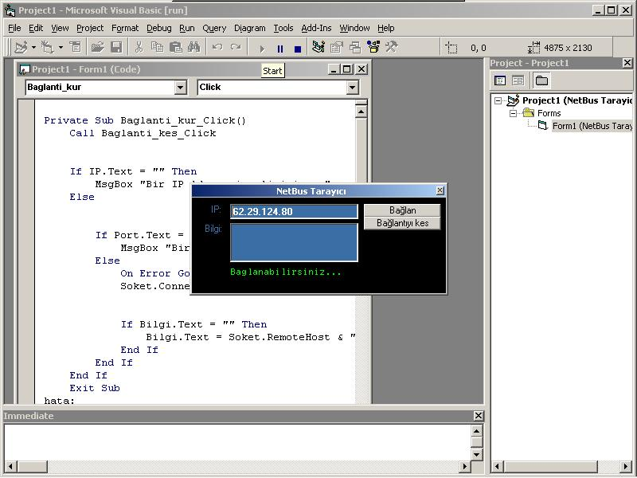

<div align="center">

## Trojan Tarayici


</div>

### Description

Netbus Serverini kendi bilgisayarinizda veya karsi bilgisayarda taratabilirsiniz.
 
### More Info
 


<span>             |<span>
---                |---
**Submitted On**   |
**By**             |[Yigit Aktan](https://github.com/Planet-Source-Code/PSCIndex/blob/master/ByAuthor/yigit-aktan.md)
**Level**          |Beginner
**User Rating**    |4.4 (31 globes from 7 users)
**Compatibility**  |VB 6\.0
**Category**       |[Coding Standards](https://github.com/Planet-Source-Code/PSCIndex/blob/master/ByCategory/coding-standards__1-43.md)
**World**          |[Visual Basic](https://github.com/Planet-Source-Code/PSCIndex/blob/master/ByWorld/visual-basic.md)
**Archive File**   |[](https://github.com/Planet-Source-Code/yigit-aktan-trojan-tarayici__1-27214/archive/master.zip)


### Source Code

```
' Ilk önce Form Penceresinde gerekli düzenlemeler yapilir.
' 2Button, 3tane Text Box, 3tane Label ve 1 de Winsock yaratiliir.
'Labeller:
'1 Label Baglanti kuruldugunda baglanilan IP yi göstermesi için.
'1 Label Baglanti kuruldugunda baglanilan Portu göstermesi için.
'1 Label Baglantinin kurulup kurulmadigini bize bildirmesi için.
' Buttonlar:
' 1 Button Baglanti kurmak için.
' 1 Button Baglantiyi kesmek için.
' Text Boxlar:
' 1 Text Box IP Adres girmek için.
' 1 Text Box kullanilacak Portu girmek için..
' Ve Son olan Text Box da programin çalismasi durumunda bize bilgi vermesi için.
' Bazi degisimler yapmaniz gerekiyor çünkü yazdigim kodda ben öyle yaptim.
' Eger Visual Basic ToolBox inizda Winsock yoksa ToolBox a sag okla tiklayin,
' Components a girin ve ordan seçin.
' Formumuza koydugumuz Winsock in ismini "Soket" yapin ve isimleri asagidaki gibi degistirin;
' Text1.Text -----> IP.Text
' Text2.Text -----> Port.Text (Visible i False yapin)
' Text3.Text -----> Bilgi.Text (mutiline i ve locked i True yapin)
' Command1 -----> Baglanti_kur (bu Commandlarda Name e yazilir Caption Farketmez)
' Command2 -----> Baglanti_kes
' Label1 ------> Aciklama1
' Label2 ------> Aciklama2
' Label3 ------> Aciklama3
' Form üzerindeki tamamlamalarimiz bittikten sonra Kodlarimiza basliyoruz...
' Eeee artik baslamanin zamani geldi.
' ©opy®ight 2001 - Yigit Aktan
' yigitaktan@yahoo.com
Private Sub Baglanti_kur_Click()
Call Baglanti_kes_Click
'Burda eger IP adresini bos birakirsaniz bize uyari mesaji vermesini sagliyoruz.
If IP.Text = "" Then
MsgBox "Bir IP Adres girmelisiniz..."
Else
'Burda da eger Port Numarasini bos birakirsaniz bize uyari mesaji vermesini sagliyoruz.
'Ama bu kodu girmesenizde olur ben her ihtimale karsi Port.Text 'i basta size invisible yaptirdim.
If Port.Text = "" Then
MsgBox "Bir Port Numarasi girmelisiniz..."
Else
'Eger bi hata olusursa önlemimizi alip hata: adli yere yolluyoruz.
On Error GoTo hata
'Winsock 'un yani bizim Soketin IP ve Port Textimizi okuyarak girilen verilere baglanmasini deniyoruz.
Soket.Connect IP.Text, Port.Text
'Bilgi.Text imizin bos kalmasi durumunda NetBus serverinin bulunamadigini anliyoruz ve
'Bilgi.Text imizde bize bunu bildirmesini istiyoruz.
If Bilgi.Text = "" Then
Bilgi.Text = Soket.RemoteHost & " da Netbus Serveri bulunamadi..."
'Simdi aklima geldi Açtigim If leri kapamayi unutmustum simdi kapiyoruz :-D
End If
End If
End If
Exit Sub
'Önceden bahsettigim hata ya simdi geldik... Eger Programimizda bi hata olusursa bize,
'bi uyari mesaji verip tamama tikladigimizda programdan çikmamizi sagliyoruz.
hata:
MsgBox "Lütfen Programi bastan baslatin."
End
'End Sub diyip Baglan dügmemizin kodlarini tamamliyoruz.
End Sub
'Simdi Baglantiyi kesecegimiz dügmemizin Kodlarini yazmaya basliyoruz...
Private Sub Baglanti_kes_Click()
'Baglantiyi Kes dügmemize tikladigimizda Winsocku yani Soket i kapatiyoruz.
Soket.Close
'Winsock kapatildiginda labelimizin basligini degistirip bize winsockun
'kapandigini söylemesini istiyoruz.
Aciklama3.Caption = "Baglanti Kesildi."
'Winsock kapandiginda Form üzerine yüklenen verilerin silinmesi sagliyoruz. (IP,Port,Bilgi)
Aciklama1.Caption = ""
Bilgi.Text = ""
Aciklama2.Caption = ""
End Sub
'Burda Formumuzu istedigimiz gibi açiyoruz.
Private Sub Form_Load()
'IP.Textimize kendi IP mizi yazdiriyoruz.
IP.Text = Soket.LocalIP
'Port.Textimize de NetBus Portu olan 12345 i yaziyoruz, ama bunu siz formda
'görmeyeceksiniz çünkü Port.Text i basta invisible yaptik.
'Yine hatirlatim bunun için Port.Texti seçip Properties e girip Visible i False yapmaniz yeterli.
Port.Text = "12345"
'Programi açtigimizda bize herseyin hazir oldugunu ve baglanabilecegimizi,
'söylemesini sagliyoruz.
Aciklama1.Caption = "Baglanabilirsiniz..."
End Sub
' ***********************************************************
'Bu bölüm sizin için gereksiz olabilir ama ben titiz davranip yapma geregini duydum.
'Burda Baglan dügmemize basmadan sadece Ip yi yazip enter a basip
'programi çalistirmamizi sagliyoruz...
Private Sub IP_KeyPress(KeyAscii As Integer)
If KeyAscii = 13 Then
KeyAscii = 0
Call Baglanti_kes_Click
Call Baglanti_kur_Click
End If
End Sub
' ***********************************************************
' Evet burda artik Winsock ayarlarimiza basliyoruz...
'Unutmayin basta Winsockun adini Soket yapmistik.
Private Sub Soket_Connect()
'Server a baglanildiginda Label3e yani basta degistirmistik Aciklama3e Baglanildi yaziyoruz.
Aciklama3.Caption = "Baglanildi."
'Aciklama1 e Baglandigimiz IP yi yazdiriyoruz.
Aciklama1.Caption = " Ip: " & Soket.RemoteHost
'Aciklama2 yede Baglandigimiz Portu yazdiriyoruz.
Aciklama2.Caption = "Port: " & Soket.RemotePort
End Sub
'Burasi Winsockun önemli kismi...
Private Sub Soket_DataArrival(ByVal bytesTotal As Long)
'ilk önce bi String ifade tanimlamasi yapiyoruz ben Veri dedim buna...
Dim Veri As String
'Winsockun Server a baglanip verileri almasini sagliyoruz.
Soket.GetData Veri, vbString
'Bilgi.Textimizi onun için hazirlayip bosaltiyoruz.
Bilgi.Text = ""
'Winsockun aldigi verileri Bilgi.Text imize yazdiriyoruz.
Bilgi.Text = Bilgi.Text & Veri
Bilgi.SelStart = Len(Bilgi)
'Burda Bilgi.Text imizin bos kaldigi takdirde, Winsock un Server la baglanti kuramadigini
'anlayip Bilgi.Text imize girdigimiz IP de NetBus Server inin bulanamadigini yazdiriyoruz.
If Bilgi.Text = "" Then
Bilgi.Text = Soket.RemoteHost & " da Netbus Serveri bulunamadi..."
End If
End Sub
```

